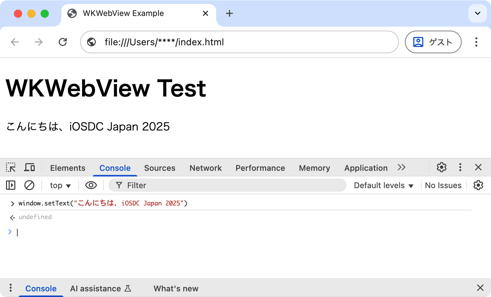
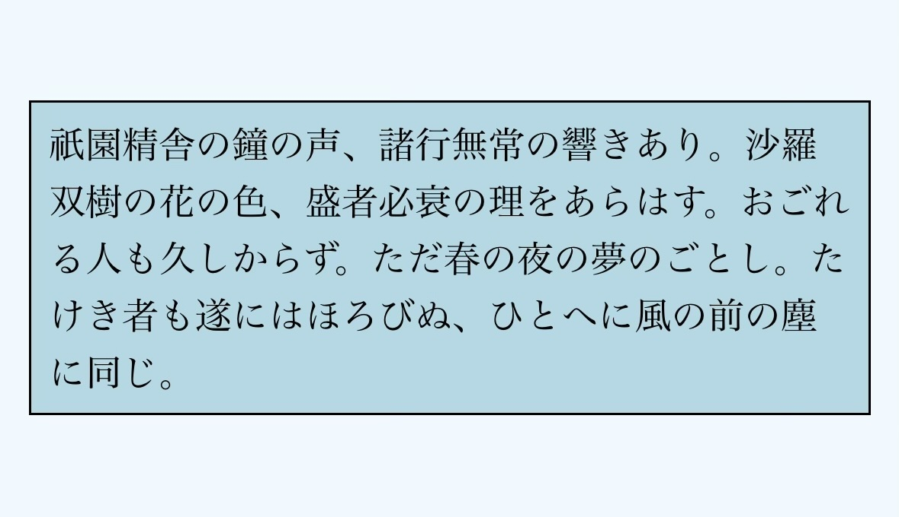
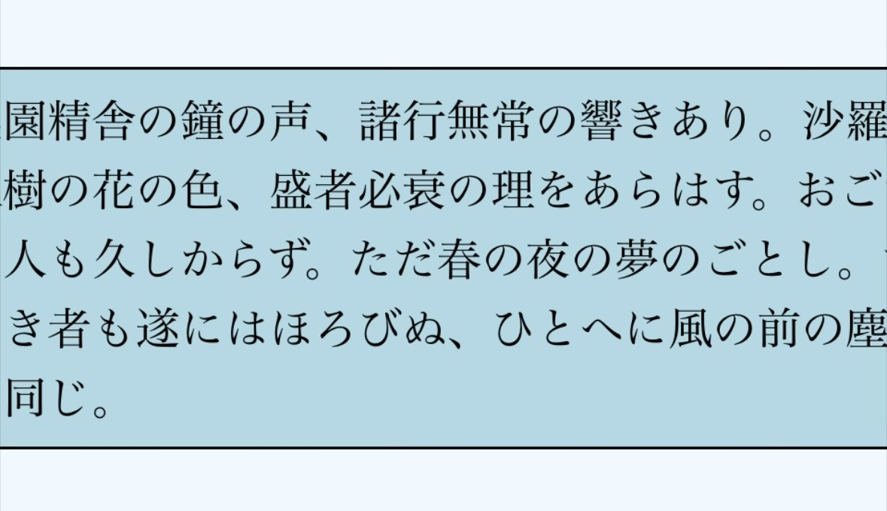

# モバイルアプリ開発者のための<BR />WebView と JavaScript の制御実践

<!-- <div class="author-info">
江本光晴（株式会社ゆめみ）<BR />
𝕏 @mitsuharu_e
</div> -->

<!-- アイコン付き著者プロフィール -->
<div class="profile-container">
  
  <div class="profile-text-area">
  <div class="profile-text-main">江本光晴</div>
  <div class="profile-text-sub">株式会社ゆめみ / 𝕏 @mitsuharu_e</div>
  </div>
</div>

次のような目的などから、モバイルアプリに WebView を組み込んで HTML ファイルを表示させることがあるでしょう。

- 既存サービス等の HTML ファイルを活用する
- 最軽量かつ最小限のクロスプラットフォームとして、iOS と Android で機能と表示を共通化する

この場合、単純に HTML を表示するだけとは限りません。JavaScript などを利用してアプリからパラメータを渡すなど、外部から HTML を制御することがあります。

ここで、モバイルアプリエンジニアは、必ずしも HTML や JavaScript に詳しいわけではありません。この実装を進めると、さまざまな問題に直面することも少なくありません。本記事は iOS アプリで WKWebView を組み込んで、JavaScript で制御するときの問題点や、その解決方法を紹介します。

## 環境

本記事の開発環境は、MacBook Pro 14 インチ 2021 / Apple M1 Pro / メモリ 32 GB / macOS Sequoia 15.5 です。Xcode 16.2 で検証しています。ソースコードの説明に Swift だけでなく、JavaScript なども利用します。ここで、JavaScript は JS と表記する場合もあります。

## 問題設定

問題として、次の HTML ファイルを仮定します。この HTML は JavaScript 関数 `window.setText()` を持ち、その関数で HTML 内のテキスト表示を制御します。なお、この HTML は ChatGPT が製作しました。

```html
<!DOCTYPE html>
<html lang="ja">
<head>
  <meta charset="UTF-8">
  <meta name="viewport" content="width=device-width, initial-scale=1.0">
  <title>WKWebView Example</title>
  <script>
    function setText(text) {
      document.getElementById("display").innerText = text;
    }
  </script>
</head>
<body>
  <h1>WKWebView Test</h1>
  <p id="display">デフォルトテキスト</p>
</body>
</html>
```

次の画像例のように、JavaScript の関数 `window.setText()` を実行するとテキスト表示が更新されます。



この HTML を iOS アプリに組み込んで、JavaScript の関数を実行してテキスト表示を制御します。この場合、次のような Swift 関数を実装すれば、アプリから JavaScript 関数を実行できます。なお、この関数内の webView は WKWebView のインスタンスです。

```swift
func updateWebViewText(with text: String) {
  let code = """
  const text = "\(text)";
  window.setText(text);
  """
  webView.evaluateJavaScript(code) { _, error in
    if let error {
      print(error) // このエラー処理は暫定処理です
    }
  }
}
```

この関数 `updateWebViewText(with:)` を利用すれば、JavaScript 関数が実行されて表示制御されます。しかしながら、この関数は、いくつかの問題が抱えています。この関数を安心して使えるようにしましょう。

以降で説明する内容は iOS / Swift 側の実装を対象として、次の３つの自作関数を軸に説明します。なお、HTML 側の修正や編集は行いません。

| 関数名 | 目的 |
| :-- | :-- |
| setUpWebView() | WKWebView の初期化や addSubView(_:) などを行う |
| loadWebView() | WKWebView で HTML ファイル（index.html）を読み込む |
| updateWebViewText(with:) | アプリから JavaScript 関数を実行して、文字を更新する |

## 関数の呼び出しタイミング

WKWebView で HTML ファイル（index.html）を読み込むには、次のような実装で実現できます。

```swift
func loadWebView() {
  guard let url = Bundle.main.url(forResource: "index", 
                                  withExtension: "html")
  else {
    assertionFailure("index.html is not found.")
    return
  }
  let request = URLRequest(url: url)
  webView.load(request)
}
```

準備ができたら、次のように関数それぞれを実行していきます。HTML を読み込んだ WebView が表示されて「こんにちは、iOSDC Japan 2025」という文字が表示されるはずですが、エラーが発生します。

```swift
setUpWebView() // webView の初期設定
loadWebView()  // html の読み込み
updateWebViewText(with: "こんにちは、iOSDC Japan 2025")
```

次のようなエラーが JavaScript 側で発生しました。

```javascript
Error Domain=WKErrorDomain Code=4 "A JavaScript exception occurred"
UserInfo={WKJavaScriptExceptionLineNumber=2, WKJavaScriptExceptionMessage
=TypeError: window.setText is not a function. (In 'window.setText(text)',
'window.setText' is undefined), WKJavaScriptExceptionColumnNumber=19,
WKJavaScriptExceptionSourceURL=undefined, NSLocalizedDescription=
A JavaScript exception occurred}
```

このエラーは `'window.setText' is undefined` と書かれているとおり、定義したはずの関数が未定義になっているのが原因です。HTML の読み込みが完了しないと、定義された関数は利用できません。そこで、読み込み完了を待ってから、関数を実行します。

```swift
extension ViewController {
  override func viewDidLoad() {
    super.viewDidLoad()
    setUpWebView()
    loadWebView()
    updateWebViewText(with: "こんにちは didFinish 前の世界") // JS で失敗する
  }
  
  // webView を初期設定する関数
  func loadWebView() {
    // ...
    webView.navigationDelegate = self // 読み込み完了を検知するためのデリゲート
    // ...
  }
}
```

```swift
extension ViewController: WKNavigationDelegate {

  // 読み込み完了のデリゲート関数
  public func webView(_ webView: WKWebView, didFinish navigation: WKNavigation!) {
    updateWebViewText(with: "こんにちは didFinish 後の世界") // JS で成功する
  }

  // 読み込み失敗のデリゲート関数
  public func webView(_ webView: WKWebView, didFail navigation: WKNavigation!, withError error: any Error) {
    print("didFail \(error)")
  }
}
```

HTML に組み込まれた関数を実行するには、その HTML の読み込みが完了してから実行します。この例では、読み込み完了のデリゲート関数で実行しました。そのほか、任意なタイミングで実行する場合は、この読み込み完了の状態（関数実行可能フラグ）を保存して制御するのもよいでしょう。

### 読み込み完了イベントが独自の場合

HTML の実装や関数の特性によってはライフサイクルが独自な場合もあるでしょう。その場合、HTML が発行するイベントをアプリがメッセージとして受け取ることで解決することがあります。HTML の仕様は、その設計者に確認してください。例として、独自イベントを HTML に追加実装するには余白が足りないので、一般的なイベント load、error、そして unhandledrejection を監視しました。

```swift
extension ViewController {
  private func setUpWebView() {
    // アプリで対応するメッセージ名を設定する
    let messageName = "yourMessageName"
    
    let contentController = WKUserContentController()
    
    // アプリで受け取るメッセージを設定する
    contentController.add(self, name: messageName)
    
    // HTML に埋め込む JavaScript のコードを定義する
    let source = """
    window.addEventListener('load', (event) => {
      const message = {type: 'onLoad', message: event.message};
      const json = JSON.stringify(message);
      window.webkit.messageHandlers.\(messageName).postMessage(json);
    });
    window.addEventListener('error', (event) => {
      const message = {type: 'onError',
                       message: event.error?.message ?? event.message};
      const json = JSON.stringify(message);
      window.webkit.messageHandlers.\(messageName).postMessage(json);
    });
    window.addEventListener('unhandledrejection', (event) => {
      const message = {type: 'onException', message: event.reason};
      const json = JSON.stringify(message);
      window.webkit.messageHandlers.\(messageName).postMessage(json);
    });
    """
```

```swift
    let userScript = WKUserScript(source: source, injectionTime: .atDocumentEnd, forMainFrameOnly: true)
    contentController.addUserScript(userScript)
    
    let config = WKWebViewConfiguration()
    config.userContentController = contentController
    
    webView = WKWebView(frame: .zero, configuration: config)
    // ...
  }
}

extension ViewController: WKScriptMessageHandler {
  func userContentController(_ userContentController: WKUserContentController, didReceive message: WKScriptMessage) {
    // message.name はメッセージ受け取りで設定した messageName に対応する
    // message.body はメッセージ本文であり、この情報を利用してアプリで処理する
  }
}
```

このように、アプリから JavaScript のコードを WebView に埋め込むことで、HTML のイベントをアプリが取得できます。この注入は、HTML/CSS の簡単な機能追加や修正などにも利用できます。

## JavaScript に渡す文字列のエンコード

関数 `updateWebViewText(with:)` は Swift の文字列を JavaScript に直接渡しています。その渡す文字列に特殊文字（`"` や `\n` など）が含まれていると、エラーになります。

```javascript
Error Domain=WKErrorDomain Code=4 "A JavaScript exception occurred"
UserInfo={WKJavaScriptExceptionLineNumber=1, WKJavaScriptExceptionMessage=
SyntaxError: Unexpected EOF, WKJavaScriptExceptionColumnNumber=0, 
WKJavaScriptExceptionSourceURL=file://****/index.html, 
NSLocalizedDescription=A JavaScript exception occurred}
```

Swift と JavaScript で一部文字の扱いが異なるため、解釈不一致が起こっています。これを防ぐため、文字列をエスケープしてから渡します。そして、JavaScript のコードではアンエスケープした文字列を利用します。

```swift
func updateWebViewText(with text: String) {
  guard let encodedText = text.addingPercentEncoding(withAllowedCharacters: .urlQueryAllowed) else {
    return
  }
  // ↓ このコードブロックは、もはや Swift ではなく JavaScript です！
  let code = """
  const text = decodeURIComponent("\(encodedText)");
  window.setText(text);
  """
  webView.evaluateJavaScript(code) { _, error in
    if let error {
      print(error)
    }
  }
}
```

例では文字列を渡しましたが、オブジェクトを渡したい場合もあるでしょう。Swift と JavaScript で、オブジェクトは異なるので、直接渡すことはできません。その場合、オブジェクトを JSON 文字列に変換して、Swift から JavaScript に渡します。そして、JavaScript 側でオブジェクトに戻して利用します。このときも文字列変換を忘れずに行います。なお、複雑なオブジェクトは不向きなので、関数設計は注意しましょう。

## 関数実行のスコープ

例で挙げた更新関数の実行は１回だけとは限らず、任意なタイミングやイベントに合わせて複数回実行されるでしょう。たとえば、次のように、関数を連続して実行します。

```swift
updateWebViewText(with: "テキスト１")
updateWebViewText(with: "テキスト２")
```

残念ながら、この場合もエラーが起こります。

```javascript
Error Domain=WKErrorDomain Code=4 "A JavaScript exception occurred"
UserInfo={WKJavaScriptExceptionLineNumber=0, WKJavaScriptExceptionMessage=
SyntaxError: Can't create duplicate variable: 'text', 
WKJavaScriptExceptionColumnNumber=0, NSLocalizedDescription=
A JavaScript exception occurred}
```

この連続した関数の実行は、WebView では次のように解釈されます。同じスコープで実行されています。つまり、同名定数が再定義されたため、JavaScript でエラーが起こりました。

```swift
// Swift で updateWebViewText(with: "テキスト１") を実行した
const text = decodeURIComponent("テキスト１");
window.setText(text);

// Swift で updateWebViewText(with: "テキスト２") を実行した
const text = decodeURIComponent("テキスト２"); // 同名定数の再定義でエラー！
window.setText(text);
```

２つ目の定数 text を別名に変えれば実行できますが、実行ごとにユニークな命名をするのは不可能です。そこで、関数を実行するスコープを分けることで回避します。

```swift
func updateWebViewText(with text: String) {
  guard let encodedText = text.addingPercentEncoding(withAllowedCharacters: .urlQueryAllowed) else {
    return
  }
  let code = """
  try {
    const text = decodeURIComponent("\(encodedText)");
    window.setText(text);
  } catch (error) {
    throw error
  }
  """
```

```swift
  webView.evaluateJavaScript(code) { _, error in
    if let error {
      print(error)
    }
  }
}
```

今回はスコープを分けるため、無難に try-catch を採用しました。これによって、関数を何回実行しても、それぞれのスコープ内で実行されるので、名前が衝突することはありません。

## 関数の完了結果を待つ

これまでの例は実行するだけで、その実行結果を取得していません。実行順序が重要な場合やエラー結果を取得したい場合もあるでしょう。そこで、Swift Concurrency を使って、非同期関数にします。

```swift
func updateWebViewText(with text: String) async throws {
  // 略...
  try await withCheckedThrowingContinuation { [weak self] continuation in
    guard let webView = self?.webView else { return }
    webView.evaluateJavaScript(code) { _, error in
      if let error {
        continuation.resume(throwing: error)
      } else {
        continuation.resume()
      }
    }
  } as Void
}
```

次のように、順番ごとに実行されます。

```swift
func updateWebViewTextSequence() {
  Task { @MainActor in
    do {
      try await updateWebViewText(with: "await 1")
      try await updateWebViewText(with: "await 2")
      try await updateWebViewText(with: "await 3")
    } catch {
      print(error)
    }
  }
}
```

## 拡大表示の考慮

iOS には多くのアクセシビリティ機能が用意されており、その１つに「拡大表示（Display Zoom）」があります。この機能は、システム全体のスケーリング倍率を高め、画面上に表示される要素を視認しやすくします。iPhone の初期セットアップ時や、「設定」アプリ内の「画面表示と明るさ」から有効化できます。

WKWebView は標準コンポーネントのレンダリングとは異なります。WebView におけるコンポーネントは HTML や CSS で定義され、WebKit によってレンダリングされます。

たとえば iPhone 16 において、Retina 倍率はデフォルトでは 3 倍ですが、拡大表示を有効にすると約 3.68 倍になり、座標系は 393×852 から 320×693 に変化します。悪い例ですが、CSS で `.box { width: 380px; height: 160px;}` のようにサイズ固定していると、次のように見切れることがあります。

|デフォルト表示（正常）|拡大表示（見切れ）|
|:-:|:-:|
| | |

実際の拡大倍率を取得するには UIScreen.main.nativeScale を利用します。ここで、すでに UIScreen.main は Deprecated ですが、残り余白は正確に書くには狭すぎるので、利用しました。ご了承ください。

```swift
let retinaScale = UIScreen.main.scale       // Retina 倍率（端末ごとに固定）
let nativeScale = UIScreen.main.nativeScale // 実際の倍率（設定により可変）
```

HTML は端末の Retina 倍率を取得できますが、実際の倍率は取得できません。したがって、アプリから nativeScale の情報を WebView に渡します。例として、アプリ側でサイズを補正します。

```swift
let scale = retinaScale / nativeScale
let scaledSize = CGSize(width: 380 * scale, height: 160 * scale)
```

そして、その補正されたサイズの CSS を HTML に注入します。

```css
.box { width: \(scaledSize.width)px; height: \(scaledSize.height)px; }
```

他にも、nativeScale を JS 関数で渡して HTML 側で補正する手段もあります。

例として、作りが悪い CSS を挙げました。一般に座標サイズが異なっても CSS で調整できます。HTML/CSS で固定サイズが必須な場合は、アプリの仕様から見切れることがあるので、FE エンジニアに相談しましょう。

## まとめ

iOS アプリに WKWebView を組み込む場合に起こりうる問題とその解決方法を紹介しました。今回の実装例は次のリポジトリにあります。本記事の内容が皆様の開発のお役に立てば幸いです。WKWebView、難しい…

```url
https://github.com/mitsuharu/SampleWKWebViewApp
```
