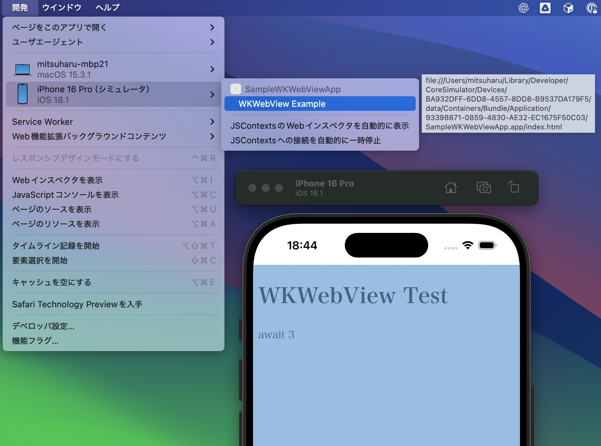
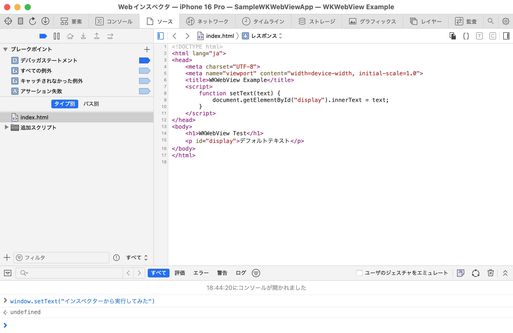

# モバイルアプリ開発者のための<BR />WebView と JavaScript の制御実践

<div class="author-info">
江本光晴（株式会社ゆめみ）<BR />
𝕏: @mitsuharu_e
</div>

<!-- アイコン付き著者プロフィール -->
<!-- <div class="profile-container">
  
  <div class="profile-text-area">
  <div class="profile-text-main">サンプルたろう</div>
  <div class="profile-text-sub">株式会社サンプル</div>
  <div class="profile-text-sub">https://example.com</div>
  </div>
</div> -->

次のような理由などで、モバイルアプリに WebView を組み込んで HTML を表示させることがあるでしょう。

- 既存サービス等の HTML ファイルを活用する
- 最軽量かつ最小限のクロスプラットフォームとして、iOS と Android で機能と表示を揃える

モバイルアプリエンジニアは、必ずしも HTML や JavaScript に詳しいわけではないため、実装上の問題に直面することも少なくありません。今回は iOS アプリで WKWebView を組み込んだときの問題点や、その解決方法を紹介します。

## 環境

本記事の開発環境は、MacBook Pro 14 インチ 2021 / Apple M1 Pro / メモリ 32 GB / macOS Sequoia 15.5 です。Xcode 16.2 で検証しています。Swift だけでなく、JavaScript なども利用しています。ここで、JavaScript は JS と表記する場合もあります。

## 問題設定

次の HTML ファイルを想定します。この HTML は JavaScript 関数 `window.setText()` を持ち、その関数で HTML 内のテキスト表示を制御します。なお、この HTML は ChatGPT が製作しました。

```html
<!DOCTYPE html>
<html lang="ja">
<head>
  <meta charset="UTF-8">
  <meta name="viewport" content="width=device-width, initial-scale=1.0">
  <title>WKWebView Example</title>
  <script>
    function setText(text) {
      document.getElementById("display").innerText = text;
    }
  </script>
</head>
<body>
  <h1>WKWebView Test</h1>
  <p id="display">デフォルトテキスト</p>
</body>
</html>
```

次の画像例のように、JavaScript の関数 `window.setText()` を実行するとテキスト表示が更新されます。


この HTML を iOS アプリに組み込んで、JavaScript の関数を実行してテキスト表示を制御したいです。この場合、次のような Swift 関数を実装すれば、アプリから JavaScript 関数を実行できます。なお、この関数内の webView は WKWebView のインスタンスです。

```swift
func setWebViewText(text: String) {
  let code = """
  const text = "\(text)";
  window.setText(text);
  """
  webView.evaluateJavaScript(code) { _, error in
    if let error {
      print(error) // このエラー処理は暫定処理です
    }
  }
}
```

この関数 `setWebViewText(text:)` を利用すれば、JavaScript 関数が実行されて表示制御されます。しかしながら、この関数は、いくつかの問題が抱えています。この関数を安心して使えるようにしましょう。

以降で説明する内容は iOS / Swift 側の実装で、主に次の３つの自作関数を対象とします。HTML 側の修正や編集はしません。

| 関数名 | 目的 |
| :-- | :-- |
| setUpWebView() | webView の初期化や addSubView(_:) などを行う |
| loadWebView() | webView で HTML ファイル（index.html）を読み込む |
| setWebViewText(text: ) | アプリから JavaScript 関数を実行して、文字を表示する |

## 関数の呼び出しタイミング

webView で HTML ファイル（index.html）を読み込むには、次のような実装で実現できます。

```swift
func loadWebView() {
  guard let url = Bundle.main.url(forResource: "index", withExtension: "html") else {
    assertionFailure("index.html is not found.")
    return
  }
  let request = URLRequest(url: url)
  webView.load(request)
}
```

準備できたら、関数それぞれを実行していきます。HTML を読み込んだ WebView が表示されて「こんにちは、iOSDC Japan 2025」という文字が表示されるはずですが、エラーが発生します。

```swift
setUpWebView() // webView の初期設定
loadWebView()  // html の読み込み
setWebViewText(text: "こんにちは、iOSDC Japan 2025")
```

次のようなエラーが JS 側で起こります（元のエラー文は改行無しですが、見やすくするため改行しています）。

```javascript
Error Domain=WKErrorDomain Code=4 "A JavaScript exception occurred"
UserInfo={WKJavaScriptExceptionLineNumber=2, WKJavaScriptExceptionMessage
=TypeError: window.setText is not a function. (In 'window.setText(text)',
'window.setText'　is undefined), WKJavaScriptExceptionColumnNumber=19,
WKJavaScriptExceptionSourceURL=undefined, NSLocalizedDescription=
A JavaScript exception occurred}
```

このエラーは `'window.setText' is undefined` と書かれているとおり、定義したはずの関数が未定義になっています。HTML の読み込みが完了しないと、定義された関数は利用できません。そこで、読み込み完了を待ってから、関数を実行します。

```swift
extension ViewController {
  override func viewDidLoad() {
    super.viewDidLoad()
    setUpWebView()
    loadWebView()
    setWebViewText(text: "こんにちは didFinish 前の世界") // JS で失敗する
  }
  
  // webView を初期設定する関数
  func loadWebView() {
    // ...
    webView.navigationDelegate = self // 読込みイベントを利用するためのデリゲート
    // ...
  }
}
```

```swift
extension ViewController: WKNavigationDelegate {

  // 読込み完了
  public func webView(_ webView: WKWebView, didFinish navigation: WKNavigation!) {
    setWebViewText(text: "こんにちは didFinish 後の世界")
  }

  // 読込み失敗
  public func webView(_ webView: WKWebView, didFail navigation: WKNavigation!, withError error: any Error) {
    print("didFail \(error)")
  }
}
```

HTML に組み込まれている関数を実行する場合、その HTML の読み込みが完了してから実行します。この例では、完了通知のデリゲート内で実行していますが、任意なタイミングで実行する場合は完了状態（関数実行可能）フラグを変数に保存しましょう。

### 完了イベントが独自の場合

HTML の実装や関数の特性によってはライフサイクルが独自なものもあるでしょう。その場合、HTML が発行するイベントを WKWebView が受け取ることで解決します（HTML の仕様は、設計者に確認しましょう）。独自イベントを HTML に実装するのはページが足りないので、例として、一般的なイベント load、error、そして unhandledrejection を監視しました。

```swift
extension ViewController {
  private func setUpWebView() {
    // アプリで対応できるイベント名を設定する
    let eventName = "yourEventName"
    
    let contentController = WKUserContentController()
    
    // イベント受け取りの設定
    contentController.add(self, name: eventHandlerName)
    
    // HTML に埋め込む JavaScript のコードの設定
    let source = """
    window.addEventListener('load', (event) => {
      const message = {type: 'onLoad', message: event.message};
      const jsonString = JSON.stringify(message);
      window.webkit.messageHandlers.\(eventName).postMessage(jsonString);
    });
    window.addEventListener('error', (event) => {
      const message = {type: 'onError', message: event.error?.message ?? event.message};
      const jsonString = JSON.stringify(message);
      window.webkit.messageHandlers.\(eventName).postMessage(jsonString);
    });
    window.addEventListener('unhandledrejection', (event) => {
      const message = {type: 'onException', message: `${event.reason}`};
      const jsonString = JSON.stringify(message);
      window.webkit.messageHandlers.\(eventName).postMessage(jsonString);
    });
    """

    let userScript = WKUserScript(source: source, injectionTime: .atDocumentEnd, forMainFrameOnly: true)
    contentController.addUserScript(userScript)
    
    let config = WKWebViewConfiguration()
    config.userContentController = contentController
    
    webView = WKWebView(frame: .zero, configuration: config)
    // ...
  }
}

extension ViewController: WKScriptMessageHandler {
  func userContentController(_ userContentController: WKUserContentController, didReceive message: WKScriptMessage) {
    print("didReceive \(message.name), \(message.body),")
  }
}
```

このように、アプリから JavaScript のコードを HTML に埋め込んむことで、HTML のイベントを iOS 側で取得できます。この注入は簡単な機能修正などもできます。

## JavaScript に渡す文字列のエンコード

関数 `setWebViewText(text:)` は Swift の文字列を JavaScript に直接渡しています。渡す文字列に特殊文字（`"`, `\`など）が含まれていると、エラーになります。

```javascript
Error Domain=WKErrorDomain Code=4 "A JavaScript exception occurred"
UserInfo={WKJavaScriptExceptionLineNumber=1, WKJavaScriptExceptionMessage=
SyntaxError: Unexpected EOF, WKJavaScriptExceptionColumnNumber=0, 
WKJavaScriptExceptionSourceURL=file://****/index.html, 
NSLocalizedDescription=A JavaScript exception occurred}
```

Swift と JavaScript で文字の意味が異なるため、解釈不一致が起こっています。これを防ぐため、文字列をエスケープしてから渡します。そして、JavaScript のコードでアンエスケープした文字列を利用します。

```swift
func setWebViewText(text: String) {
  guard let encodedText = text.addingPercentEncoding(withAllowedCharacters: .urlQueryAllowed) else {
    return
  }
  // ↓ このコードブロックは、もはや Swift ではなく JavaScript です！
  let code = """
  const text = decodeURIComponent("\(escapedText)");
  window.setText(text);
  """
  webView.evaluateJavaScript(code) { _, error in
    if let error {
      print(error)
    }
  }
}
```

今回の例は文字列を渡してますが、オブジェクトを渡したいときもあるでしょう。Swift と JavaScript でオブジェクトは異なるので、オブジェクトを渡すことはできません。その場合、オブジェクトを JSON 文字列に変換して、Swift から JavaScript に渡ます。そして、JavaScript 側でオブジェクトに戻して利用します。このときもエスケープ・アンエスケープを忘れずに行いましょう。

## 関数実行のスコープ

更新関数の実行は一度きりとは限らず、任意なタイミングで実行されるでしょう。たとえば、次のように、関数を連続して実行します。

```swift
setWebViewText(text: "テキスト１")
setWebViewText(text: "テキスト２")
```

残念ながら、エラーが起こります。

```javascript
Error Domain=WKErrorDomain Code=4 "A JavaScript exception occurred"
UserInfo={WKJavaScriptExceptionLineNumber=0, WKJavaScriptExceptionMessage=
SyntaxError: Can't create duplicate variable: 'text', 
WKJavaScriptExceptionColumnNumber=0, NSLocalizedDescription=
A JavaScript exception occurred}
```

連続した関数の実行は、WebView では次のような JavaScript として解釈されます。同じスコープで実行されています。つまり、同名変数が再定義されたため、JavaScript でエラーが起こりました。

```swift
// Swift で setWebViewText(text: "テキスト１") を実行した
const text = decodeURIComponent("テキスト１");
window.setText(text);

// Swift で setWebViewText(text: "テキスト２") を実行した
const text = decodeURIComponent("テキスト２"); // 同名定数の再定義！
window.setText(text);
```

２つ目の定数 `text` を別名に変えれば実行できますが、実行ごとにユニークな命名をするのは実装不可です。そこで、関数を実行するスコープを分けることで回避します。

```swift
func setWebViewText(text: String) {
  guard let encodedText = text.addingPercentEncoding(withAllowedCharacters: .urlQueryAllowed) else {
    return
  }
  let code = """
  try {
    const text = decodeURIComponent("\(escapedText)");
    window.setText(text);
  } catch (error) {
    throw error
  }
  """
  webView.evaluateJavaScript(code) { _, error in
    if let error {
      print(error)
    }
  }
}
```

今回はスコープを分けるため、無難に try-catch を採用しました。これによって、関数を何回実行しても、それぞれのスコープ内で実行されるので、名前が衝突することはありません。

安全性から余り好ましくないですが、副作用などを想定して、過去に定義した値を利用することもあるでしょう。その場合は、スコープを外すことになるので、定数名が衝突しないように注意が必要です。

## 関数の完了結果を待つ

これまでの例は実行するだけで、その実行結果は取得してきませんでした。実行順序が大切な場合やエラー結果を取得したい場合もあるでしょう。そこで、Swift Concurrency を使って、非同期関数にします。

```swift
func setWebViewText(text: String) async throws {
  // 略...
  try await withCheckedThrowingContinuation { [weak self] continuation in
    guard let webView = self?.webView else { return }
    webView.evaluateJavaScript(code) { _, error in
      if let error {
        continuation.resume(throwing: error)
      } else {
        continuation.resume()
      }
    }
  } as Void
}
```

次のように順番ごとに実行できるようになりました。

```swift
func setWebViewTextSequence() {
  Task { @MainActor in
    do {
      try await setWebViewText(text: "await 1")
      try await setWebViewText(text: "await 2")
      try await setWebViewText(text: "await 3")
    } catch {
      print(error)
    }
  }
}
```

## HTML の動作検証

HTML のデバッグは iOS アプリエンジニアの責務を越えますが、動作検証はしたいです。ブラウザの開発者モードやインスペクターを利用すると、動作確認ができます。

### 開発者モード

HTML を Chrome や Safari などのブラウザで開き、メニューから開発者モードを選択します。HTML ファイルで定義されたコンポーネントなどが確認できます。また、コンソールから関数を実行して、動作確認ができます。

ブラウザの例で Chrome も挙げましたが、ブラウザごとにエンジンが異なるので、iOS アプリなら Safari で確認するのが望ましいです。なお、Safari の開発者モードは設定から有効します。

### インスペクター

アプリに組み込んだ WebView（HTML）は Safari のインスペクターで確認できます。コードからインスペクターできるように設定します。

```swift
private func setUpWebView() {
  // 略...
  
#if DEBUG
  // iOS 16.4 以上はこの設定が必要です
  webView.isInspectable = true
#endif
}
```

実機の場合は、さらに、端末の設定から「Safari」→「詳細」に進んで、「Webインスペクタ」を有効にします。

そして、Safari の「開発」からシミュレータまたは実機の WebView（HTML）を選択します。複数の WebView があると多くの候補が表示されます。同名が並んでどれが確認したいものか分かりづらいですが、マウスオーバーでコンポーネントが選択される（青くなる）ので、確認したいものを選択します。



インスペクタでは、開発者モードと同様な確認ができます。



## 拡大率の考慮

iOS には多くのアクセシビリティ機能が用意されており、その１つに「拡大表示（Display Zoom）」があります。この機能は、システム全体のスケーリング倍率を高め、画面上に表示される要素を視認しやすくします。iPhone の初期セットアップ時や、「設定」アプリ内の「画面表示と明るさ」から有効化できます。

### 拡大表示とWKWebViewの表示崩れ

WKWebView は標準コンポーネントのレンダリングとは異なります。HTML や CSS で定義されたコンポーネントは WebKit によってレンダリングされます。このレンダリング処理は、iOS のネイティブとは別に動作しているため、拡大設定がそのまま反映されるわけではありません。

たとえば、iPhone 16 における Retina 倍率はデフォルトでは 3 倍ですが、拡大表示を有効にすると約 3.68 倍になり、画面全体の座標系は変化します。`.box { width: 300px; height: 200px;}` のように、CSS でサイズ固定していると問題が起こります。想定する領域を越えて、文字や画像が切れてしまいます。

|デフォルト|拡大表示|
|:-:|:-:|
| | |

### 実機の拡大状態を取得する

アプリで実際の拡大倍率を取得するには、UIScreen.main.nativeScale を利用します。ここで、UIScreen.main は Deprecated ですが、説明の簡略化のため利用しました。実際に利用する際は、適切に置き換えてください。

```swift
let scale = UIScreen.main.scale       // Retina 倍率
let nativeScale = UIScreen.main.nativeScale // 実際の倍率
```

HTML/CSS では端末の Retina 倍率を取得できますが、実際の倍率は取得できません。つまり、nativeScale を WebView に渡さないといけません。例として、アプリ側でサイズを補正します。

```swift
let baseSize = CGSize(width: 300, height: 200)
let scale = UIScreen.main.scale/UIScreen.main.nativeScale
let width = Int(baseSize.width * scale)
let height = Int(baseSize.height * scale)
```

そして、その補正したサイズを WebView に注入します。

```css
.box {
  width: \(width)px;
  height: \(height)px;
}
```

他にも、倍率を JavaScript 関数で渡して、HTML 内で補正する手段もあります。このように、アプリで得られた情報を WebView に渡すことで、HTML/CSS 側での補正処理をサポートします。

## まとめ

本記事は iOS アプリに WKWebView を組み込んだときに、起こりうる問題とその解決方法を紹介しました。今回の実装例は次のリポジトリにあります。

https://github.com/mitsuharu/SampleWKWebViewApp

WKWebView はネイティブのコンポーネントといえど、内部は Web の世界が広がっています。今回紹介した以外にも HTML 固有の問題が起こることもあり、WKWebView を利用した開発は大変です。分からない原因で悩み、なぜかアレコレしたら治ったこともあります。WKWebView、難しい。
